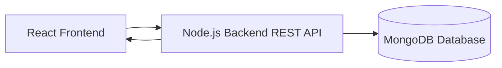

# TodoSnap

A simple and clean React Todo application connected to a backend API. It allows you to fetch, add, and delete tasks with a straightforward and user-friendly interface.

---

## Features

- Fetch all todos from the backend  
- Add new todo items  
- Delete existing todos  
- Simple and minimal UI built with React  

---

# TodoSnap

A simple and clean React Todo application connected to a backend API. It allows you to fetch, add, and delete tasks with a straightforward and user-friendly interface.

---

## Features

- Fetch all todos from the backend  
- Add new todo items  
- Delete existing todos  
- Simple and minimal UI built with React  

---

## Architecture Diagram

##Installation

- Clone the repository:

git clone https://github.com/your-username/todosnap.git

- Navigate to the project directory:

cd todosnap

- Install dependencies:

npm install

- Start the React app:

npm start

Make sure your backend server is running on http://localhost:5000.

## Usage

Click the Get All Todos button to load existing todos.

Use the input box to type a new todo and press Add to save it.

Click the Delete button next to a todo to remove it.

## Tech Stack

React

Fetch API for HTTP requests

Node.js backend (assumed running separately)

MongoDB (for database)

## Contributing

Feel free to fork the repo and submit pull requests. Suggestions and improvements are welcome!

